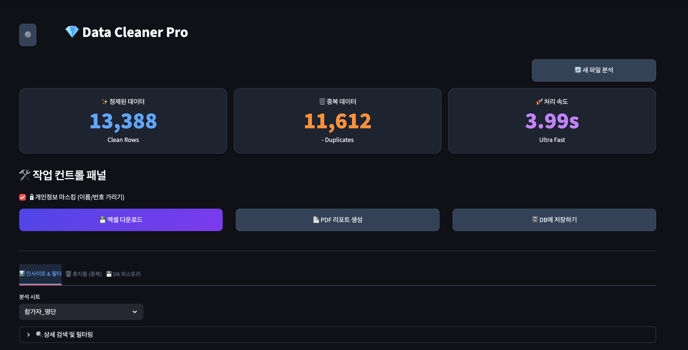
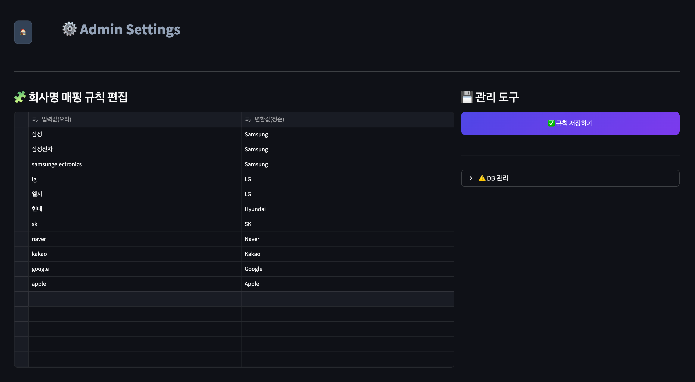

# 🧹 MICE Excel Data Cleaner


**MICE Excel Data Cleaner**는 컨벤션, 전시회 등 MICE 행사에서 발생하는 대량의 참가자/부스 리스트를 **단 1초 만에** 표준화하고 중복을 제거해주는 **올인원 데이터 전처리 솔루션**입니다.

---

## 💡 기획 의도 (Project Motivation)

**"수천 명의 참가자 명단, 정리에만 반나절... 1초 만에 끝낼 수는 없을까?"**

행사나 컨퍼런스를 운영하며 수집되는 엑셀 데이터는 늘 **중복, 오타, 서식 불일치** 문제로 가득했습니다. 수천 건의 데이터를 사람이 일일이 눈으로 확인하며 `Ctrl+F`로 중복을 제거하는 방식은 비효율적일 뿐만 아니라, 실수(Human Error)로 인해 중요한 데이터를 날릴 위험이 컸습니다.

이 프로젝트는 이러한 **반복적인 비효율(Toil)을 기술로 자동화**하여 업무 생산성을 극대화하기 위해 시작되었습니다.

단순한 스크립트를 넘어, 비개발자 동료들도 직관적으로 사용할 수 있도록 **웹 GUI(Streamlit)**를 도입했습니다. 더 나아가 실시간 **데이터 시각화(Dashboard)**, **DB 아카이빙**, 그리고 **Q&A 소통 채널**까지 통합하여 **"사내 엔터프라이즈급 데이터 솔루션"**을 목표로 개발했습니다.

---

## 🖥️ 실행 화면 (Preview)

| 메인 대시보드 | 관리자 설정 & Q&A |
| :---: | :---: |
|  |  |
| *직관적인 KPI 카드와 실시간 반응형 차트* | *매핑 규칙 관리 및 사용자 문의 답변* |

> *※ `assets` 폴더에 스크린샷 이미지 파일을 넣어주세요.*

---

## ✨ 주요 기능 (Key Features)

### 1. 🧹 강력한 데이터 정제 (Smart Cleaning)
*   **서식 통일:** 휴대폰 번호(`010-1234-5678` → `01012345678`), 이메일 소문자화, 공백 제거.
*   **자동 매핑:** `Samsung Electronics` → **`Samsung`**, `South Korea` → **`대한민국`** 등 회사/국가명 자동 통일.
*   **정보 누락 감지:** 이메일이나 전화번호가 없는 행을 자동으로 찾아내어 태깅합니다.

### 2. 🛡️ 안전한 중복 제거 (Safe Deduplication)
*   데이터를 절대 영구 삭제하지 않습니다. 중복된 행은 **'휴지통' 탭**으로 이동시켜 보관합니다.
*   **교차 검증:** 이메일, 전화번호, 이름+소속 등 다중 조건으로 중복을 정밀하게 잡아냅니다.

### 3. 📊 인사이트 대시보드 (Smart Dashboard)
*   업로드한 데이터의 특성을 분석하여 **직급, 성별, 지역, 국가 분포** 등을 자동으로 시각화합니다.
*   데이터 필터링 시 차트가 실시간으로 반응하며, 다크 모드에 최적화된 디자인을 제공합니다.

### 4. 💬 Q&A 및 관리자 모드 (Admin & Support)
*   **Q&A 게시판:** 사용자가 앱 내에서 바로 오류 제보나 문의를 남길 수 있습니다.
*   **관리자 페이지:** 관리자는 로그인 후 매핑 규칙을 수정하거나, 사용자 문의에 답변을 달 수 있습니다.
*   **보안:** 관리자 페이지는 아이디/비밀번호(`env`) 인증을 거쳐야만 접근 가능합니다.

### 5. 🗄️ 데이터베이스 및 리포트 (DB & Report)
*   작업한 모든 데이터는 **SQLite DB**에 시트별로 자동 저장되며, **SQL 쿼리**로 조회 가능합니다.
*   **PDF 리포트:** 정제 통계와 주요 현황을 요약한 보고서를 생성합니다.
*   **마스킹 다운로드:** 외부 공유용으로 이름(`김*수`), 전화번호(`010****1234`)를 가려서 엑셀을 다운로드할 수 있습니다.

---

## 📂 프로젝트 구조 (Structure)

```text
mice_excel_data_cleaner/
├── 📄 app.py                  # 메인 실행 파일 (Streamlit Web App)
├── 📄 make_sample.py          # 테스트용 대량 데이터(25,000건) 생성기
├── 📄 requirements.txt        # 라이브러리 의존성 목록
├── 📄 .env                    # (직접 생성) 관리자 ID/PW 설정 파일
│
├── 📂 modules/                # 핵심 기능 모듈 (기능별 분리)
│   ├── cleaner.py             # 정제, 마스킹, 매핑 알고리즘 (Vectorized)
│   ├── database.py            # DB 저장, Q&A 관리, SQL 실행 로직
│   └── reporter.py            # PDF 리포트 생성 로직
│
├── 📂 data/                   # (자동 생성) DB 및 설정 파일 저장소
│   ├── cleaned_data.db        # 작업 이력 DB (SQLite)
│   └── mapping_config.json    # 사용자 정의 매핑 규칙 JSON
│
└── 📂 fonts/                  # (필수) PDF용 한글 폰트 폴더
    └── NanumGothic.ttf        # 네이버 나눔고딕 폰트
```

---

## 🚀 시작하기 (Getting Started)

### 1. 설치 (Installation)

```bash
# 레포지토리 클론
git clone https://github.com/your-username/mice_excel_data_cleaner.git
cd mice_excel_data_cleaner

# 필수 라이브러리 설치
pip install -r requirements.txt
```

### 2. 필수 설정 (Configuration)

1.  **한글 폰트:** PDF 리포트 생성을 위해 프로젝트 루트에 `fonts` 폴더를 만들고 **`NanumGothic.ttf`** 파일을 넣어주세요.
2.  **관리자 계정:** 프로젝트 루트에 **`.env`** 파일을 만들고 관리자 정보를 입력하세요.
    ```env
    ADMIN_ID=admin
    ADMIN_PW=1234
    ```

### 3. 테스트 데이터 생성 (Optional)

개발 및 테스트를 위해 25,000건 이상의 가상 데이터를 생성할 수 있습니다.

```bash
python make_sample.py
```
*   `DATA` 폴더에 `참가자_테스트_Sample.xlsx` 파일이 생성됩니다.

### 4. 웹 앱 실행 (Run)

```bash
streamlit run app.py
```
*   브라우저가 열리면 생성된 엑셀 파일을 업로드하여 분석을 시작하세요.

---

## 🛠️ 사용 기술 (Tech Stack)

*   **Frontend:** Streamlit (Custom CSS, Responsive UI)
*   **Data Processing:** Pandas (Vectorization Optimization), Python-Calamine (High-performance Reader)
*   **Visualization:** Plotly Express (Interactive Charts)
*   **Database:** SQLAlchemy, SQLite
*   **Reporting:** FPDF2

---

## 📝 라이선스 (License)

This project is licensed under the MIT License.
