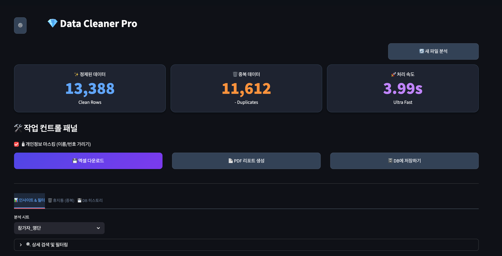
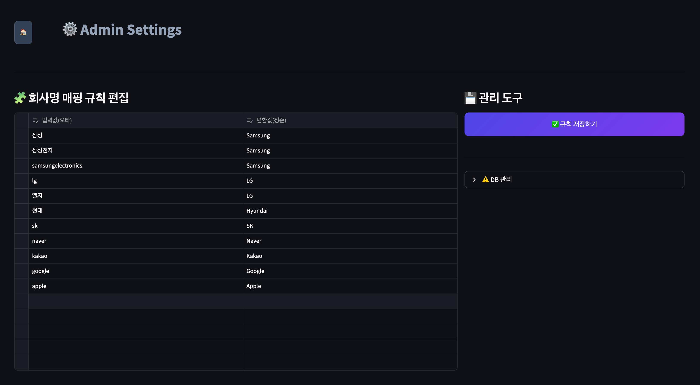
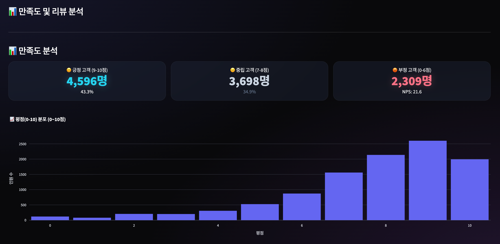
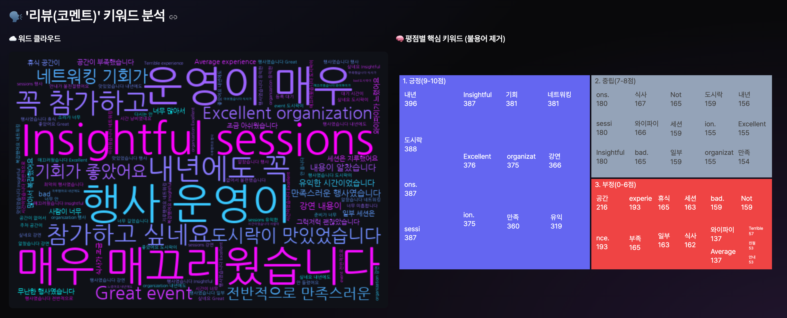
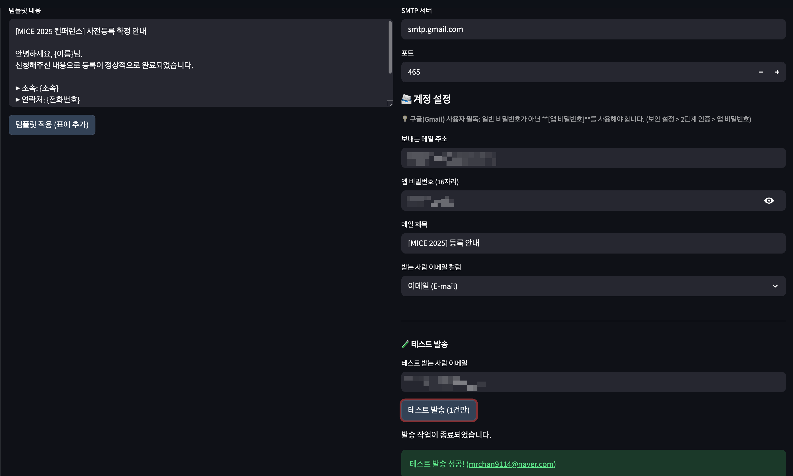
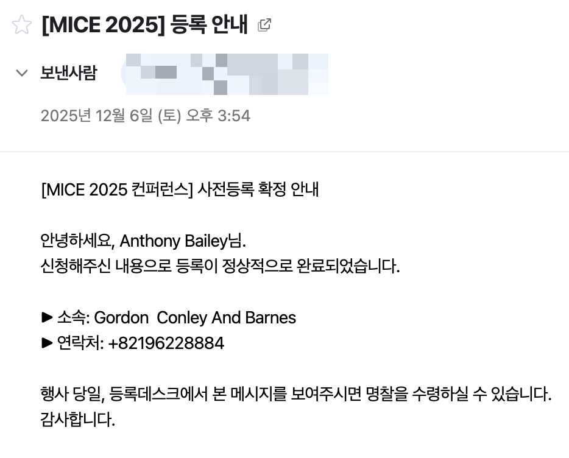

# 🧹 MICE Excel Data Cleaner Pro


**MICE Excel Data Cleaner Pro**는 컨벤션/전시회 등 MICE 행사에서 발생하는 대량의 참가자·부스 리스트를 **빠르게 표준화하고 중복을 제거**하는 **올인원 데이터 전처리 솔루션**입니다.

---

## 💡 기획 의도

**"수천 명의 참가자 명단, 정리에만 반나절… 더 빠르게 끝낼 수는 없을까?"**

행사 운영 중 수집되는 엑셀 데이터는 **중복, 오타, 서식 불일치**가 잦고, 수작업 정리는 실수(Human Error)로 중요한 데이터를 놓칠 위험이 큽니다.

이 프로젝트는 반복적인 비효율(Toil)을 자동화해 생산성을 높이기 위해 시작되었습니다.  
비개발자도 쉽게 사용할 수 있도록 **Streamlit 기반 웹 GUI**를 제공하며, **대시보드 시각화 / DB 아카이빙 / 이메일 자동 발송 / PDF 리포트**까지 통합한 “현업형 도구”를 목표로 개발했습니다.

---

## 🖥️ 실행 화면

| 메인 대시보드 | 관리자 설정 & Q&A |
| :---: | :---: |
|  |  |
| 직관적인 KPI 카드와 반응형 차트 | 매핑 규칙 관리 및 사용자 문의 답변 |

---

## 🧠 만족도 & 리뷰 분석 대시보드 (NEW)

행사 종료 후 설문 데이터를 기반으로 **평점(0–10점) 및 리뷰 텍스트**를 한눈에 분석합니다.

### 1) 만족도 분석 (NPS)
- 응답자 자동 분류: **긍정(9–10) / 중립(7–8) / 부정(0–6)**
- 그룹별 **인원 수/비율** 및 **NPS(Net Promoter Score)** 계산
- 평점 분포 히스토그램으로 만족도 분포 확인



### 2) 리뷰(코멘트) 키워드 분석
- 전체 리뷰 기반 **워드클라우드** 시각화
- 평점 구간별(긍정/중립/부정) 핵심 키워드 비교 → 운영 개선 인사이트 도출



---

## 📧 이메일 자동 발송 기능

<table>
  <thead>
    <tr>
      <th width="50%" style="text-align:center">템플릿 작성 및 발송</th>
      <th width="50%" style="text-align:center">실제 수신 화면</th>
    </tr>
  </thead>
  <tbody>
    <tr>
      <td align="center">
        
      </td>
      <td align="center">
        
      </td>
    </tr>
    <tr>
      <td align="center"><i>변수({이름}) 기반 템플릿 작성 & 대량 발송</i></td>
      <td align="center"><i>개인화된 내용 수신 확인(테스트)</i></td>
    </tr>
  </tbody>
</table>

---

## ✨ 주요 기능

### 1) 🧹 데이터 정제 (Smart Cleaning)
- **서식 통일:** 휴대폰/이메일/공백/대소문자 정리
- **자동 매핑:** 회사명/기관명/국가명 등 표준화
- **정보 누락 감지:** 이메일·전화번호 누락 행 탐지

### 2) ♻️ 휴지통 복구 (Data Rescue)
- 중복 제거 데이터는 즉시 삭제하지 않고 **휴지통 탭**으로 이동
- 체크박스로 선택 후 **즉시 복구**

### 3) 📊 인사이트 대시보드 (Dashboard)
- 업로드 데이터 기반 분포 자동 시각화 (직급/지역/국가 등)
- 필터 적용 시 차트가 실시간 반응

### 4) 🗄️ DB 저장 & 리포트 (DB & Report)
- 시트별 **SQLite 저장**, SQL로 조회 가능
- **PDF 리포트 생성**
- 외부 공유용 **마스킹 엑셀 다운로드**

---

## 🧩 리팩토링 노트 (코드 분할)

초기에는 `app.py`에 모든 기능이 들어있었지만, 유지보수와 오류 수정 속도를 위해  
UI/페이지/서비스 로직을 분리했습니다.

- 페이지: `views/`
- UI 스타일/레이아웃: `ui/`
- 분석/세션/리포트 보조 기능: `services/`
- 핵심 기능 모듈: `modules/`

---

## 📂 프로젝트 구조

```text
.
├─ app.py
├─ views/
│  ├─ dashboard.py
│  ├─ admin.py
│  └─ qna.py
├─ ui/
│  ├─ styles.py
│  ├─ components.py
│  └─ layout.py
├─ services/
│  ├─ analysis.py        # 평점/리뷰/등록일 분석 + 차트
│  ├─ pdf_assets.py      # pdf_add_plotly, pdf_add_table...
│  └─ state.py           # session_state 초기화/리셋
└─ modules/
   ├─ cleaner.py
   ├─ database.py
   ├─ reporter.py
   └─ mailer.py

---

## 🚀 시작하기 (Getting Started)

### 1. 설치 (Installation)

```bash
# 레포지토리 클론
git clone https://github.com/your-username/mice_excel_data_cleaner.git
cd mice_excel_data_cleaner

# 필수 라이브러리 설치
pip install -r requirements.txt
```

### 2. 필수 설정 (Configuration)

1.  **한글 폰트:** PDF 리포트 생성을 위해 프로젝트 루트에 `fonts` 폴더를 만들고 **`NanumGothic.ttf`** 파일을 넣어주세요.
2.  **관리자 계정:** 프로젝트 루트에 **`.env`** 파일을 만들고 관리자 정보를 입력하세요.
    ```env
    ADMIN_ID=admin
    ADMIN_PW=1234
    ```

### 3. 테스트 데이터 생성 (Optional)

개발 및 테스트를 위해 25,000건 이상의 가상 데이터를 생성할 수 있습니다.

```bash
python make_sample.py
```
*   `DATA` 폴더에 `참가자_테스트_Sample.xlsx` 파일이 생성됩니다.

### 4. 웹 앱 실행 (Run)

```bash
streamlit run app.py
```
*   브라우저가 열리면 생성된 엑셀 파일을 업로드하여 분석을 시작하세요.

---

## 🛠️ 사용 기술 (Tech Stack)

*   **Frontend:** Streamlit (Custom CSS, Responsive UI)
*   **Data Processing:** Pandas (Vectorization Optimization), Python-Calamine (High-performance Reader)
*   **Visualization:** Plotly Express (Interactive Charts)
*   **Database:** SQLAlchemy, SQLite
*   **Reporting:** FPDF2
*   **Communication:** Python SMTP (Email Automation)

---

## 📝 라이선스 (License)

This project is licensed under the MIT License.
